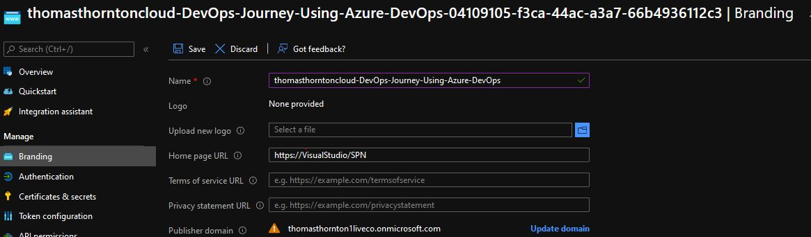

# Azure DevOps setup

## Azure DevOps Organisation Setup
The first setup to setting up Azure DevOps is to create an organisation

1. [Sign into Azure DevOps](https://go.microsoft.com/fwlink/?LinkId=307137)
2. Select **New Organisation**
3. Enter your preferred Azure DevOps organisation name & hosting location (In this lab, I will be using thomasthorntoncloud organisation)
4. Once you have created your organisation, you can sign into your organisation anything using
`https://dev.azure.com/{yourorganization`

Once an organisation has been setup, next is to create an Azure DevOps project

## Azure DevOps Project Creation
Creating a project allows you to use repositories, pipelines etc. 

1. [Sign into Azure DevOps](https://go.microsoft.com/fwlink/?LinkId=307137)
2. Select organisation that you have created above
3. Select **New Project**
4. Enter new project name & description

## Azure Service Principal Creation
A Service Principal (SPN) is considered a best practice for DevOps within your CI/CD pipeline. It is used as an identity to authenticate you within your Azure Subscription to allow you to deploy the relevant Terraform code.

1. To begin creation, within your newly created Azure DevOps Project – select **Project Settings**
2. Select **Service Connections**
3. Select **Create Service Connection** -> **Azure Resource Manager** -> **Service Principal (Automatic)**
4. Enter subscription/resource group to where service connection will be created. Create with relevant service connection name

5. Once created you will see similar to below (You can select **Manage Service Principal** to review further)

6. Within** Manage Service Principal** options, branding -> name to give a relevant name for service principal (it creates originally with a random string at end)

7. All Service Principal role assignment to subscription, in this lab I will be giving the Service Principal **contributor** access to the subscription

You are now all set and ready to deploy to Azure using Azure Devops :)