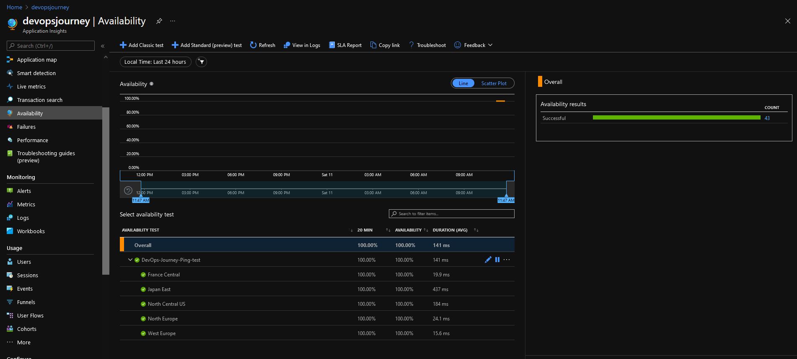

# Configure availability test using Application Insights

You can set up recurring tests to monitor availability and responsiveness. Application Insights sends web requests to your application at regular intervals from points around the world. It can alert you if your application isn't responding or responds too slowly.

You can set up availability tests for any HTTP or HTTPS endpoint that's accessible from the public internet. You don't have to make any changes to the website you're testing. In fact, it doesn't even have to be a site that you own. You can test the availability of a REST API that your service depends on.

# Types of tests

There are four types of availability tests:

- URL ping test (classic): You can create this simple test through the portal to validate whether an endpoint is responding and measure performance associated with that response. You can also set custom success criteria coupled with more advanced features, like parsing dependent requests and allowing for retries.
- Standard test (Preview): This single request test is similar to the URL ping test. It includes SSL certificate validity, proactive lifetime check, HTTP request verb (for example GET, HEAD, or POST), custom headers, and custom data associated with your HTTP request.
- Multi-step web test (classic): You can play back this recording of a sequence of web requests to test more complex scenarios. Multi-step web tests are created in Visual Studio Enterprise and uploaded to the portal, where you can run them.
- Custom TrackAvailability test: If you decide to create a custom application to run availability tests, you can use the TrackAvailability() method to send the results to Application Insights.

# Configuring a clasic test

Select Availability -> Add Classic Test

Enter details as below, URL will be the ingress IP that you have been accessing the test application on

Once configured, over time - you will be able to view additional testing information

