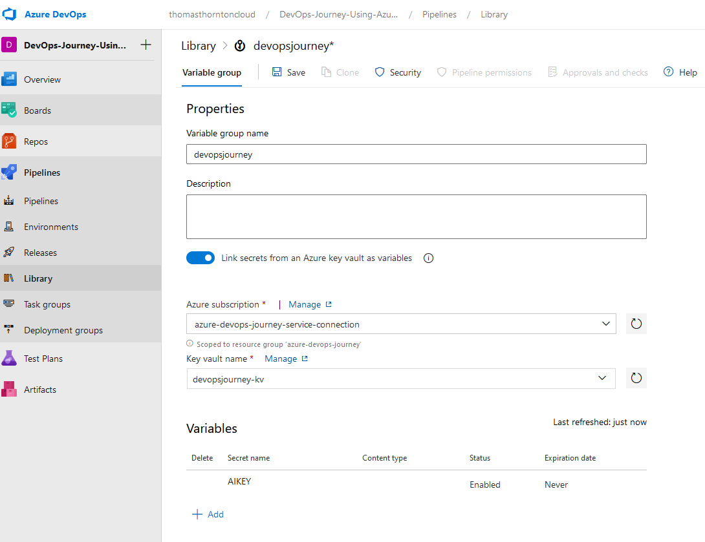

# Add Azure Key Vault to Terraform

Azure Key Vault will be used to store secrets used within your Azure DevOps Variable Group. I also recommend you read this [Blog Post on: Storing and retrieving secrets in Azure KeyVault with Variable Groups in Azure DevOps Pipelines
](https://thomasthornton.cloud/2021/06/24/storing-and-retrieving-secrets-in-azure-keyvault-with-variable-groups-in-azure-devops-pipelines/)

1. Deploy Azure Key Vault using this module: 

- [Azure Key Vault](labs/4-Deploy-App-AKS/terraform/modules/keyvault)

2. Update main.tf with [Azure Key Vault Module](labs/4-Deploy-App-AKS/terraform/main.tf#L79-L83)

3. Update [variables.tf](labs/4-Deploy-App-AKS/terraform/variables.tf#L86-L94)

4. Add new .tfvars to [this](labs/4-Deploy-App-AKS/vars/production.tfvars#L28-L29)

access_policy_id is the object group ID that you created as part of initial setup [here](labs/1-Initial-Setup/3-Create-Azure-AD-AKS-Admins.md) *Please note: add the service principal that docker uses to this group also. This was created [here](labs/3-Deploy-App-to-ACR/1-Deploy-App-to-ACR.md)*

`keyvault_name = "devopsjourney"
access_policy_id  = "7da738c2-5c92-401c-87f1-eadbcf714367"`

1. Edit your Azure DevOps pipeline to run this [Pipeline](labs/4-Deploy-App-AKS/pipelines/lab4pipeline.yaml)

2. Get Azure Application Insights Instrumentation Key using Az CLI:
`az extension add --name application-insights`
`az monitor app-insights component show --app devopsjourney -g devopsjourney-rg`

7. Add This key to Key Vault as secret `AIKEY`

`az keyvault secret set --vault-name "devopsjourney-kv" --name "AIKEY" --value "App_insights_key_value"`

8. Once the Key Vault has been created - create a new variable group: devopsjourney as below.

