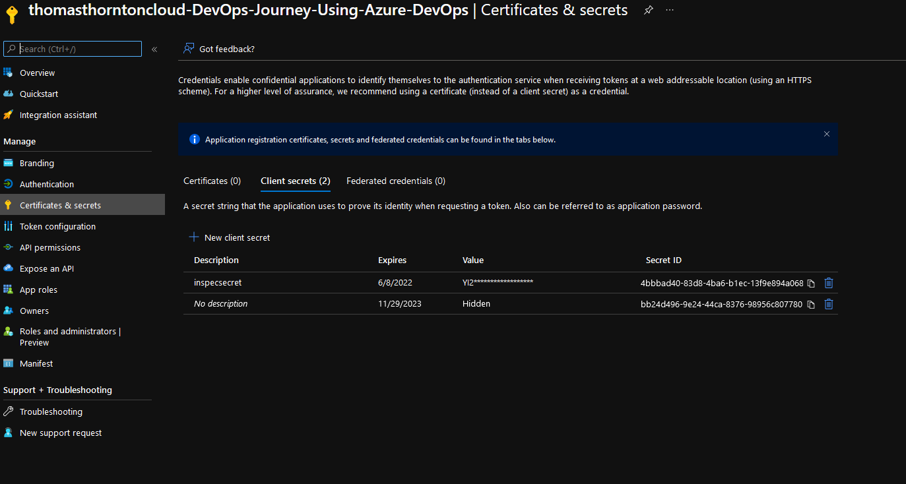
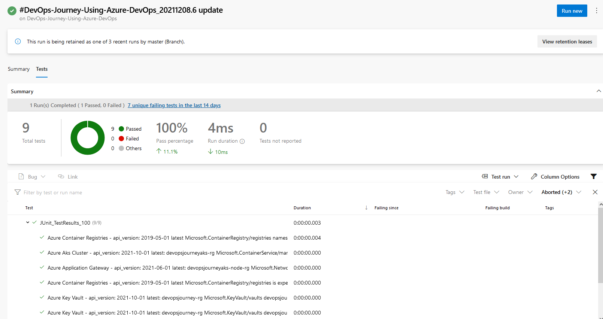

# Run Inspec-Tests using Azure DevOps

After running the Inspec tests successfully locally, its time to add this stage to your DevOps Pipeline. 

# Why run Inspec-Azure in a Pipeline?

Begin the compliance of your Azure resources right at the source, all part of your CI/CD journey – the Azure Pipeline that you are deploying Azure resources from!

Having Inspec-Azure run within your Pipeline integration can flag issues straight away and notify relevant parties that the current pipeline release has a validation testing issue. Great!

The deployment may deploy OK and look fine but the deployment has not been validated as what is expected to be deployed and the actual state the specific resources are in.

1. Some values are required to successfully run Inspec in a pipeline, these are:
- Azure Subscription ID to where Inspec will be ran against
- Azure Client ID (will be taken from service principal created previous)
- Azure Client Secret (a new secret will be created within the service principal created previous)
- Azure Tenant ID to where Inspec will be ran against

2. From the Service principal created previously to successfully create Azure resources - create and note down a new secret as below:

3. Also within service principal, select Overview and save
- Application Client ID
- Azure Tenant ID
- Also note down the subscription ID to where you deployed Azure resources

4. Add these 4 values to the Key Vault created previously that is referenced within your Azure DevOps Variable Group using the Az CLI

*Update below will relevant values*

`az keyvault secret set --vault-name "devopsjourney-kv" --name "AZURECLIENTID" --value "VALUE"`
`az keyvault secret set --vault-name "devopsjourney-kv" --name "AZURECLIENTSECRET" --value "AZURE_CLIENT_ID_VALUE"`
`az keyvault secret set --vault-name "devopsjourney-kv" --name "AZURESUBSCRIPTIONID" --value "AZURE_CLIENT_ID_VALUE"`
`az keyvault secret set --vault-name "devopsjourney-kv" --name "AZURECLIENTID" --value "AZURETENANTID"`

5. Update Variable Group with the new variables

6. Copy `azure-inspec-tests` [folder](labs/6-Testing-Infrastructure/azure-inspec-tests) to Azure DevOps repo

7. Add [inspec_tests](labs/6-Testing-Infrastructure/pipelines/lab6pipeline.yaml#L145-L174) stage to your DevOps Pipeline

8. Run pipeline and successful output shows as below:

9. Notice the new `inspec_tests` stage has a task to publish test results?

` - task: PublishTestResults@2
   displayName: Publish inspec test results
   condition: succeededOrFailed()
   inputs:
     testResultsFiles: '**/inspectestresults.xml'
     mergeTestResults: true
`

10. Inspec tests are also published to Azure DevOps! This is awesome :)

Awesome, a nice-readable test result format! 