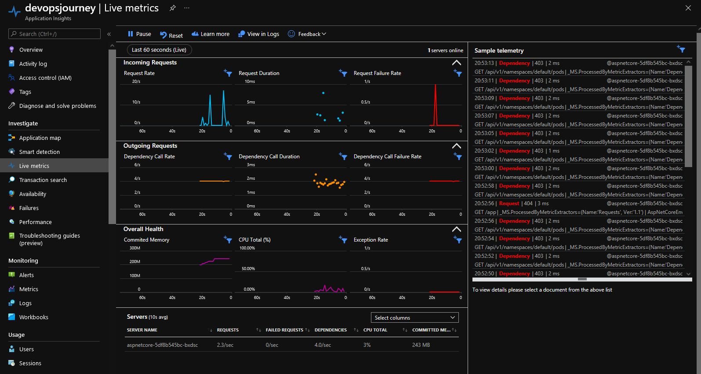
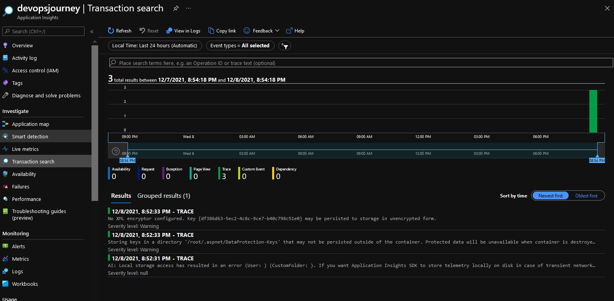
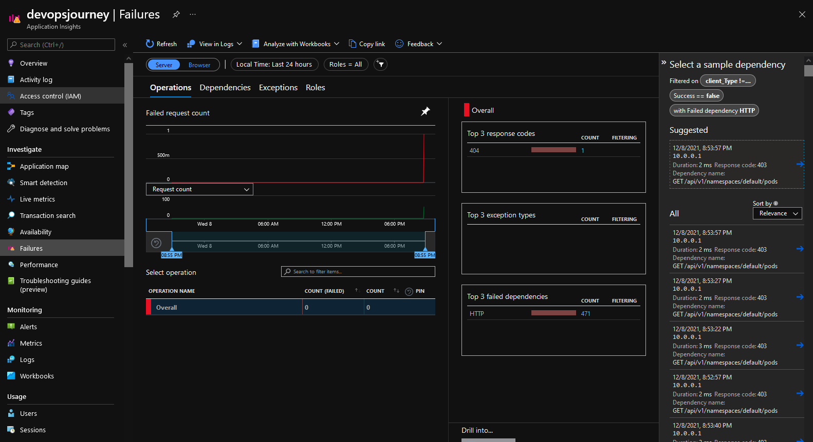

# Using Application Insights to view telemetry data!

# What is Application Insights?

Application Insights, a feature of Azure Monitor, is an extensible Application Performance Management (APM) service for developers and DevOps professionals. Use it to monitor your live applications. It will automatically detect performance anomalies, and includes powerful analytics tools to help you diagnose issues and to understand what users actually do with your app. It's designed to help you continuously improve performance and usability.

# Open Application Insights

Select the Application Insights that you created previously & also have the ingress IP to hand, we will look at some ways to view Application Insights data!

# Live Metrics
When you deploy a new build, watch these near-real-time performance indicators to make sure everything works as expected. 

# Transaction search for instance data
Search and filter events such as requests, exceptions, dependency calls, log traces, and page views.

# Viewing failures easily
Ability to view failures easily within this pain

# Application map
Explore the components of your app, with key metrics and alerts.

# Smart detection and manual alerts
Set up automatic alerts that adapt to your app's normal patterns of telemetry and trigger when there's something outside the usual pattern. You can also set alerts on particular levels of custom or standard metrics.

# Usage analysis
Analyze user segmentation and retention.

