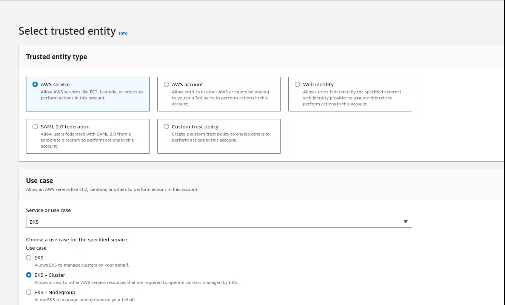
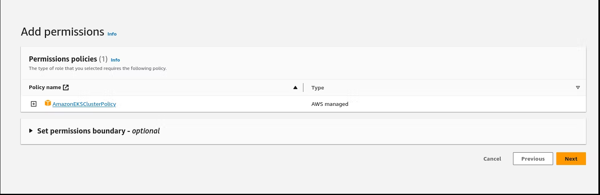
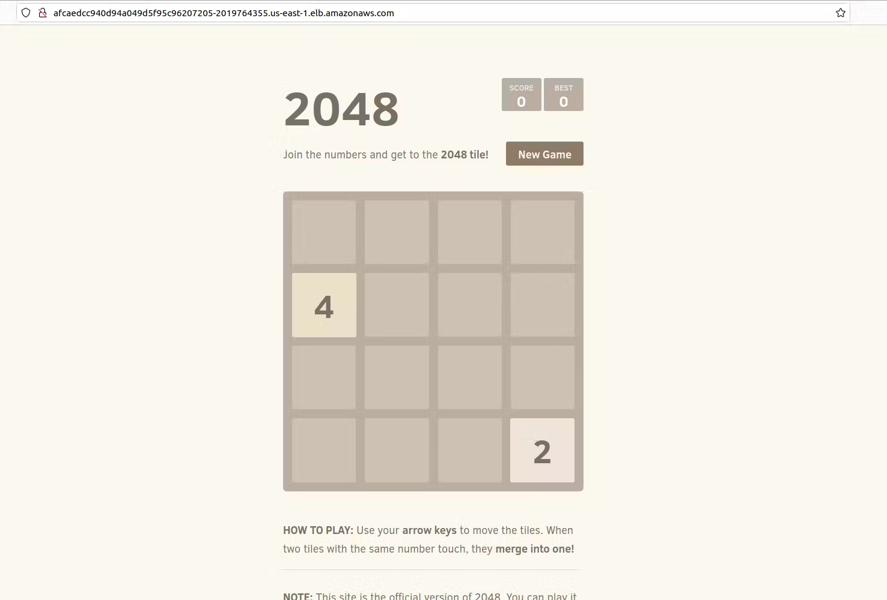

# Kubernetes End to End Project on EKS(Amazon Kubernetes Service)


## **Prerequisites**

**kubectl** – A command line tool for working with Kubernetes clusters. For more information, see Installing or updating kubectl.

**eksctl** – A command line tool for working with EKS clusters that automates many individual tasks. For more information, see Installing or updating.

**AWS CLI** – A command line tool for working with AWS services, including Amazon EKS. For more information, see Installing, updating, and uninstalling the AWS CLI in the AWS Command Line Interface User Guide. After installing the AWS CLI, we recommend that you also configure it. For more information, see Quick configuration with aws configure in the AWS Command Line Interface User Guide.

## ✅ Project Title: Deploying 2048 Game App on Amazon EKS

## ✅ Project Description

***A Kubernetes End-to-End (E2E) project for deploying a 2048 game app on Amazon Elastic Kubernetes Service (EKS) involves setting up, deploying, and managing the popular 2048 game application on a Kubernetes cluster running on AWS EKS. This project aims to demonstrate how to containerize a web application, deploy it on EKS, manage the cluster, and expose the application to users.***

## ✅ Containerization

***I began by containerizing the 2048 game using Docker. This involved creating a Dockerfile to define the application's runtime environment and dependencies, ultimately resulting in a Docker image ready for deployment.***

## ✅ Amazon EKS Setup

***I set up an Amazon EKS cluster, configuring the required resources and network settings using AWS services. This step included authentication and permissions setup to interact with the EKS cluster.***

## ✅ Deployment

***The containerized 2048 game was deployed on the EKS cluster using Kubernetes. I defined Kubernetes deployment and service YAML files to ensure the application's efficient management and availability.***

## ✅ Scaling and Management

***I explored Kubernetes's scaling capabilities, adjusting the number of application replicas based on demand. This ensured the game could handle varying levels of user traffic seamlessly***

## ✅ Application Exposure

***To make the 2048 game accessible to users, I created a Kubernetes service to expose it securely over the internet. Additionally, I could have implemented an Ingress controller for more advanced routing***

### Step 1: Create an EKS cluster




### Step 2: Create an IAM role **eks-cluster-role** with 1 policy attached: AmazonEKSClusterPolicy



```
Create another IAM role 'eks-node-grp-role' with 3 policies attached: 
(Allows EC2 instances to call AWS services on your behalf.)
    - AmazonEKSWorkerNodePolicy
    - AmazonEC2ContainerRegistryReadOnly
    - AmazonEKS_CNI_Policy
```

```
Choose default VPC, Choose 2 or 3 subnets
Choose a security group which open the ports 22, 80, 8080
cluster endpoint access: public

# For VPC CNI, CoreDNS and kube-proxy, choose the default versions, For CNI, latest and default are 
# different. But go with default.

Click 'Create'. This process will take 10-12 minutes. Wait till your cluster shows up as Active.
```

### Step 3: Add Node Groups to our cluster


```
Now, lets add the worker nodes where the pods can run

Open the cluster > Compute > Add NodeGrp
Name: <yourname>-eks-nodegrp-1 
Select the role you already created
Leave default values for everything else

AMI - choose the default 1 (Amazon Linux 2)
change desired/minimum/maximum to 1 (from 2)
Enable SSH access. Choose a security group which allwos 22, 80, 8080

Choose default values for other fields 

Node group creation may take 2-3 minutes
```

### Step 4: Authenticate to this cluster

```
Reference:
https://docs.aws.amazon.com/eks/latest/userguide/create-kubeconfig.html

Open cloudshell

# Type on your AWS CLI window 
aws sts get-caller-identity
# observe your account and user id details

# Create a  kubeconfig file where it stores the credentials for EKS:
# kubeconfig configuration allows you to connect to your cluster using the kubectl command line.
aws eks update-kubeconfig --region region-code --name my-cluster
ex: aws eks update-kubeconfig --region us-east-1 --name unus-eks-cluster-1 # Use the cluster name you just 
created


# see if you can get the nodes you created
kubectl get nodes

# Install nano editor in cloudshell. We will need this in the next task
sudo yum install nano -y
```

### Step 5: Create a new POD in EKS for the 2048 game

```
apiVersion: v1
kind: Pod
metadata:
   name: 2048-pod
   labels:
      app: 2048-ws
spec:
   containers:
   - name: 2048-container
     image: blackicebird/2048
     ports:
       - containerPort: 80
```

```
# apply the config file to create the pod
kubectl apply -f 2048-pod.yaml
#pod/2048-pod created

# view the newly created pod
kubectl get pods
```

### Step 6: Setup Load Balancer Service

```
apiVersion: v1
kind: Service
metadata:
   name: mygame-svc
spec:
   selector:
      app: 2048-ws
   ports:
   - protocol: TCP
     port: 80
     targetPort: 80
   type: LoadBalancer
```

```
# apply the config file
kubectl apply -f mygame-svc.yaml
```

```
# view details of the modified service
kubectl describe svc mygame-svc
```

```
# Access the LoadBalancer Ingress on the kops instance
curl <LoadBalancer_Ingress>:<Port_number>
or
curl a06aa56b81f5741268daca84dca6b4f8-694631959.us-east-1.elb.amazonaws.com:80
(try this from your laptop, not from your cloudshell)
```

```
# Go to EC2 console. get the DNS name of ELB and paste the DNS into address bar of the browser
# It will show the 2048 game. You can play. (need to wait for 2-3 minutes for the 
# setup to be complete)
```



## 🛠️ Author & Community  

This project is crafted by **[Harshhaa](https://github.com/NotHarshhaa)** 💡.  
I’d love to hear your feedback! Feel free to share your thoughts.  

📧 **Connect with me:**

- **GitHub**: [@NotHarshhaa](https://github.com/NotHarshhaa)  
- **Blog**: [ProDevOpsGuy](https://blog.prodevopsguy.xyz)  
- **Telegram Community**: [Join Here](https://t.me/prodevopsguy)  
- **LinkedIn**: [Harshhaa Vardhan Reddy](https://www.linkedin.com/in/harshhaa-vardhan-reddy/)  

---

## ⭐ Support the Project  

If you found this helpful, consider **starring** ⭐ the repository and sharing it with your network! 🚀  

### 📢 Stay Connected  


