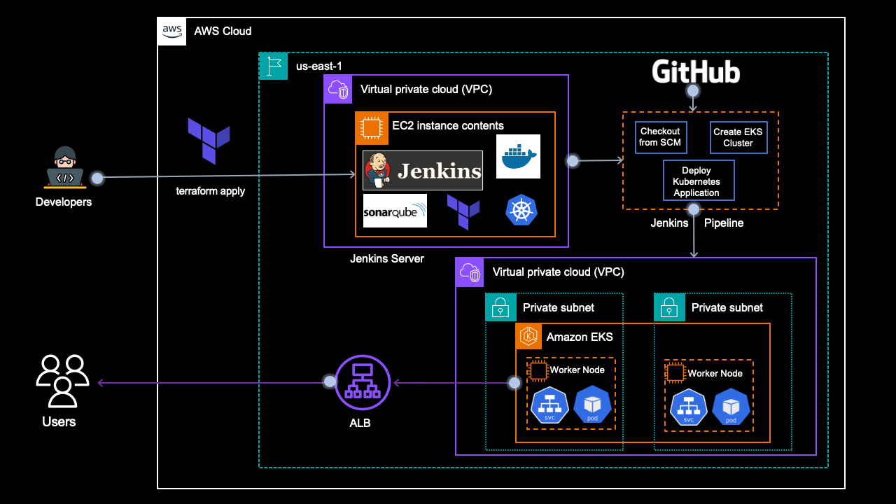

# From Scratch to Production: Deploying EKS Clusters and Applications with CI/CD using Jenkins and Terraform



## Streamlining EKS Deployment and CI/CD: A Step-by-Step Guide to Automating Application Delivery with Jenkins and Terraform

***Welcome to this step-by-step guide on deploying an EKS cluster and application with complete CI/CD!***

Are you looking to streamline your application delivery process and automate your infrastructure deployment? Look no further! In this project, I'll take you through the process of setting up an EKS cluster, deploying an application, and creating a CI/CD pipeline using Jenkins and Terraform.

We'll start with the basics and gradually dive deeper into the technical details, so you'll find this guide helpful whether you're a beginner or an experienced DevOps engineer. By the end of this article, you'll have a fully functional EKS cluster and a simple containerized application up and running, with a CI/CD pipeline that automates the entire process from code to production.

### Let's get started and explore the world of EKS, CI/CD, and automation

### **What we'll build**

We are going to build and deploy a lot of things. Here is the outline for our project:

**I. Setting up Jenkins Server with Terraform**

* Creating an EC2 instance with Terraform.

* Installing necessary tools: `Java, Jenkins, AWS CLI, Terraform CLI, Docker, Sonar, Helm, Trivy, Kubectl`.

* Configuring Jenkins server.

**II. Creating EKS Cluster with Terraform**

* Writing Terraform configuration files for `EKS` cluster creation in a private subnet.

* Deploying EKS cluster using Terraform.

**III. Deploying NGinx Application with Kubernetes**

* Writing Kubernetes manifest files `(YAML)` for the NGinx application.

* Deploying NGinx application to `EKS` cluster.

**IV. Automating Deployment with Jenkins CI/CD**

* Creating `Jenkins` pipeline for automating EKS cluster creation and Nginx application deployment.

* Integrating Terraform and Kubernetes with the Jenkins pipeline.

* Configuring continuous integration and deployment (CI/CD).

### **What we'll need**

To embark on our CI/CD adventure, we'll need a trusty toolkit:

**Terraform** — To create configuration files for the EC2 instance which will be used as a Jenkins server and EKS Cluster in a VPC.

**Shell Script —** To install command line tools in the EC2 instance.

**Jenkins file —** To create a pipeline in the Jenkins Server.

**Kubernetes Manifest files** — To create a simple NGINX application in the EKS cluster.

### **Source Code**

You can download the complete source code inside this repository.

### **Prerequisites**

Before creating and working with the project, let's set up some dev tools first -

1. It's better to have an IDE to develop your project. I am using `Visual Studio Code` for the same. You can install it from the following link based on the operating system— [https://code.visualstudio.com/download](https://code.visualstudio.com/download)

2. Install the CLI tools — [**AWS-CLI**](https://docs.aws.amazon.com/cli/latest/userguide/getting-started-install.html), and [**Terraform-CLI**](https://developer.hashicorp.com/terraform/tutorials/aws-get-started/install-cli).

3. Make sure you have an AWS Free Tier Account. And then create a user in IAM Console and finally create an `Access Key ID` and `Secret Access Key` in AWS Console for that user. You need to download these keys and then export those credentials in your terminal as follows —

```yaml
export AWS_ACCESS_KEY_ID=<Copy this from the credentials file downloaded>
export AWS_SECRET_ACCESS_KEY=<Copy this from the credentials file downloaded>
```

### **Stage 1: Configure and Build Jenkins Server**

The first thing we have to do is to create a new key pair for login into the EC2 instance and create an S3 bucket for storing terraform state files. This is the only manual step we are doing.

So, in the AWS management console go to "`EC2`" and select "`Key pairs`" in the listed overview of your resources, and then select "Create key pair" at the top right corner. You need to download these key pairs so that you can use them later for logging into the `EC2 instance`.


Create Key pairs for the EC2 instance

Next, let's create a `S3` bucket to store the terraform remote states. You can also create a `S3` bucket via Terraform but in that case, you need to apply this configuration first as the `S3` bucket must already exist before using it as a `remote backend` in Terraform. Hence, go to `S3` and `craete bucket` → `terraform-eks-cicd-7001` (Use some random number at the end to make it unique).


Create an S3 bucket to store terraform remote state

Now, let's start writing terraform configuration for our `EC2 instance` which will be used as a `Jenkins` server. So, we will create the instance first and then we will install the necessary tools like `jenkins` etc via a build script.

Here are the Terraform configuration files -

> *backend.tf*

```yaml
terraform {
  backend "s3" {
    bucket = "terraform-eks-cicd-7001"
    key    = "jenkins/terraform.tfstate"
    region = "us-east-1"
  }
}
```

> *data.tf*

```yaml
data "aws_availability_zones" "azs" {}

# Get latest Amazon Linux AMI
data "aws_ami" "amazon-linux" {
  most_recent = true
  owners      = ["amazon"]
  filter {
    name   = "name"
    values = ["amzn2-ami-*-x86_64-gp2"]
  }
  filter {
    name   = "virtualization-type"
    values = ["hvm"]
  }
}
```

> *main.tf*

```yaml
# We'll be using publicly available modules for creating different services instead of resources
# https://registry.terraform.io/browse/modules?provider=aws

# Creating a VPC
module "vpc" {
  source = "terraform-aws-modules/vpc/aws"

  name = var.vpc_name
  cidr = var.vpc_cidr

  azs            = data.aws_availability_zones.azs.names
  public_subnets = var.public_subnets
  map_public_ip_on_launch = true

  enable_dns_hostnames = true

  tags = {
    Name        = var.vpc_name
    Terraform   = "true"
    Environment = "dev"
  }

  public_subnet_tags = {
    Name = "jenkins-subnet"
  }
}

# SG
module "sg" {
  source = "terraform-aws-modules/security-group/aws"

  name        = var.jenkins_security_group
  description = "Security Group for Jenkins Server"
  vpc_id      = module.vpc.vpc_id

  ingress_with_cidr_blocks = [
    {
      from_port   = 8080
      to_port     = 8080
      protocol    = "tcp"
      description = "JenkinsPort"
      cidr_blocks = "0.0.0.0/0"
    },
    {
      from_port   = 443
      to_port     = 443
      protocol    = "tcp"
      description = "HTTPS"
      cidr_blocks = "0.0.0.0/0"
    },
    {
      from_port   = 80
      to_port     = 80
      protocol    = "tcp"
      description = "HTTP"
      cidr_blocks = "0.0.0.0/0"
    },
    {
      from_port   = 22
      to_port     = 22
      protocol    = "tcp"
      description = "SSH"
      cidr_blocks = "0.0.0.0/0"
    },
    {
      from_port   = 9000
      to_port     = 9000
      protocol    = "tcp"
      description = "SonarQubePort"
      cidr_blocks = "0.0.0.0/0"
    }
  ]

  egress_with_cidr_blocks = [
    {
      from_port   = 0
      to_port     = 0
      protocol    = "-1"
      cidr_blocks = "0.0.0.0/0"
    }
  ]

  tags = {
    Name = "jenkins-sg"
  }
}

# EC2
module "ec2_instance" {
  source = "terraform-aws-modules/ec2-instance/aws"

  name = var.jenkins_ec2_instance

  instance_type               = var.instance_type
  ami                         = "ami-0e8a34246278c21e4"
  key_name                    = "jenkins_server_keypair"
  monitoring                  = true
  vpc_security_group_ids      = [module.sg.security_group_id]
  subnet_id                   = module.vpc.public_subnets[0]
  associate_public_ip_address = true
  user_data                   = file("../scripts/install_build_tools.sh")
  availability_zone           = data.aws_availability_zones.azs.names[0]

  tags = {
    Name        = "Jenkins-Server"
    Terraform   = "true"
    Environment = "dev"
  }
}
```

> *install\_build\_tools.sh*

```shell
#!/bin/bash

# Ref - https://www.jenkins.io/doc/book/installing/linux/
# Installing jenkins
sudo yum install wget -y
sudo wget -O /etc/yum.repos.d/jenkins.repo \
    https://pkg.jenkins.io/redhat/jenkins.repo
sudo rpm --import https://pkg.jenkins.io/redhat/jenkins.io-2023.key
sudo yum upgrade -y
# Add required dependencies for the jenkins package
sudo yum install java-17-amazon-corretto-devel -y
sudo yum install jenkins -y
sudo systemctl daemon-reload

# Starting Jenkins
sudo systemctl enable jenkins
sudo systemctl start jenkins
sudo systemctl status jenkins

# Ref - https://www.atlassian.com/git/tutorials/install-git
# Installing git
sudo yum install -y git
git --version

# Installing Docker 
# Ref - https://www.cyberciti.biz/faq/how-to-install-docker-on-amazon-linux-2/
sudo yum update
sudo yum install docker -y

sudo usermod -a -G docker ec2-user
sudo usermod -aG docker jenkins

# Add group membership for the default ec2-user so you can run all docker commands without using the sudo command:
id ec2-user
newgrp docker

sudo systemctl enable docker.service
sudo systemctl start docker.service
sudo systemctl status docker.service

sudo chmod 777 /var/run/docker.sock

# Run Docker Container of Sonarqube
docker run -d  --name sonar -p 9000:9000 sonarqube:lts-community

# Installing AWS CLI
curl "https://awscli.amazonaws.com/awscli-exe-linux-x86_64.zip" -o "awscliv2.zip"
sudo apt install unzip -y
unzip awscliv2.zip
sudo ./aws/install

# Ref - https://developer.hashicorp.com/terraform/cli/install/yum
# Installing terraform
sudo yum install -y yum-utils
sudo yum-config-manager --add-repo https://rpm.releases.hashicorp.com/AmazonLinux/hashicorp.repo
sudo yum -y install terraform

# Ref - https://pwittrock.github.io/docs/tasks/tools/install-kubectl/
# Installing kubectl
sudo curl -LO https://storage.googleapis.com/kubernetes-release/release/v1.23.6/bin/linux/amd64/kubectl
sudo chmod +x ./kubectl
sudo mkdir -p $HOME/bin && sudo cp ./kubectl $HOME/bin/kubectl && export PATH=$PATH:$HOME/bin

# Installing Trivy
# Ref - https://aquasecurity.github.io/trivy-repo/
sudo tee /etc/yum.repos.d/trivy.repo << 'EOF'
[trivy]
name=Trivy repository
baseurl=https://aquasecurity.github.io/trivy-repo/rpm/releases/$basearch/
gpgcheck=1
enabled=1
gpgkey=https://aquasecurity.github.io/trivy-repo/rpm/public.key
EOF

sudo yum -y update
sudo yum -y install trivy

# Intalling Helm
# Ref - https://helm.sh/docs/intro/install/
curl -fsSL -o get_helm.sh https://raw.githubusercontent.com/helm/helm/main/scripts/get-helm-3
chmod 700 get_helm.sh
./get_helm.sh
```

Please note a few points before running `terraform apply`.

* Use the correct key pair name in the EC2 instance module `(main.tf)` and it must exist before creating the instance.

* Use the correct bucket name in the configuration for the `remote` backend `S3` in the`backend.tf`

* You need to use `user_data = file("../scripts/install_build_tools.sh")` in the EC2 module to specify the script to be executed after EC2 instance creation.

Let's run `terraform apply` and create this. Please make sure to run `terraform init` if you are doing this for the first time. Also, double-check your current working directory where you are running the `terraform cli` commands.

```yaml
(ecsproject_py310) Project-7  $  pwd                                                                                    4:18PM
/Users/vishalmishra/Study/medium/AWSDevOpsProjects/Project-7
(ecsproject_py310) Project-7  $  cd jenkins_server                                                                      4:18PM
(ecsproject_py310) jenkins_server  $  cd tf-aws-ec2                                                                     4:19PM
(ecsproject_py310) tf-aws-ec2  $  pwd                                                                                   4:19PM
/Users/vishalmishra/Study/medium/AWSDevOpsProjects/Project-7/jenkins_server/tf-aws-ec2
(ecsproject_py310) tf-aws-ec2  $  export AWS_ACCESS_KEY_ID=xxxxx                                           4:19PM
export AWS_SECRET_ACCESS_KEY=xxxxxx
(ecsproject_py310) tf-aws-ec2  $  terraform apply -var-file=variables/dev.tfvars -auto-approve    
```


terraform apply


terraform apply

Give it some time before you go to the AWS `EC2 console` and check the instance status. Even though the instance is running, it may still be installing the tools.


Jenkins Build Server Created

Now, let's log in to the Jenkins server and verify if all the tools have been installed correctly or not.

So, let's select the `EC2 instance` and hop on to connect and copy the ssh command.


ssh commands to log in to EC2 instance

Next, go to your terminal, and paste the `ssh commands`. But before this make sure you have the keypair file downloaded in your workstation.


successfully connected to the EC2 instance

We can now verify the versions of all the tools installed. Let's copy and paste the below commands.

```yaml
jenkins --version
docker --version
docker ps
terraform --version
kubectl version
aws --version
trivy --version
helm version
```

Here is the output.


Tools version installed in the Jenkins Server (EC2 instance)

Let's configure the Jenkins in the `EC2 instance`. So, copy the EC2 instance's `public IP address` and paste it into the browser by adding the `8080` port which we have provided in the security group settings for Jenkins.


Now, copy the administrator password from the below path and paste and continue.


Copy the Admin password

You will get the below screen. Click on `Install Suggested Plugins`**.**


Install Suggested Plugin


Plugin Installing

Once all the plugins are installed, you will be presented with the following screen. Here, you can continue as an admin (click on `skip and continue as admin`) **or** create a new user and password then click `Save and Continue`.


Create First Admin User


Click on `Save and Finish` and then on the next page `Start using Jenkins.`


Finally, you will get the below **Jenkins Dashboard**. At this point, we are ready with our Jenkins server. We'll configure the pipeline later.


Jenkins Dashboard

### **Stage 2: Create Terraform configuration files for creating the EKS Cluster**

#### **Task 1: Create Terraform configuration files**

Moving on, let's start writing terraform configurations for the `EKS` `cluster` in a `private` `subnet`.

We'll use the same bucket but a different key/folder for the`terraform remote state` file.

> *backend.tf*

```yaml
terraform {
  backend "s3" {
    bucket = "terraform-eks-cicd-7001"
    key    = "eks/terraform.tfstate"
    region = "us-east-1"
  }
}
```

> *vpc.tf*

```yaml
# We'll be using publicly available modules for creating different services instead of resources
# https://registry.terraform.io/browse/modules?provider=aws

# Creating a VPC
module "vpc" {
  source = "terraform-aws-modules/vpc/aws"

  name = var.vpc_name
  cidr = var.vpc_cidr

  azs            = data.aws_availability_zones.azs.names
  public_subnets = var.public_subnets
  private_subnets = var.private_subnets


  enable_dns_hostnames = true
  enable_nat_gateway = true
  single_nat_gateway = true

  tags = {
    "kubernetes.io/cluster/my-eks-cluster" = "shared"
    Terraform   = "true"
    Environment = "dev"
  }

  public_subnet_tags = {
    "kubernetes.io/cluster/my-eks-cluster" = "shared"
    "kubernetes.io/role/elb" = 1
  }

  private_subnet_tags = {
    "kubernetes.io/cluster/my-eks-cluster" = "shared"
    "kubernetes.io/role/internal-elb" = 1
  }
}
```

> *eks.tf*

```yaml
# Ref - https://registry.terraform.io/modules/terraform-aws-modules/eks/aws/latest

module "eks" {
  source  = "terraform-aws-modules/eks/aws"
  version = "~> 20.0"

  cluster_name    = "my-eks-cluster"
  cluster_version = "1.29"

  cluster_endpoint_public_access  = true

  vpc_id                   = module.vpc.vpc_id
  subnet_ids               = module.vpc.private_subnets


  eks_managed_node_groups = {
    nodes = {
      min_size     = 1
      max_size     = 3
      desired_size = 2

      instance_types = ["t2.small"]
      capacity_type  = "SPOT"
    }
  }

  tags = {
    Environment = "dev"
    Terraform   = "true"
  }
}
```

Please make a note that we are using a `private subnet` for our `EKS` `cluster` as we don't want it to be publicly accessed.

> *dev.tfvars*

```yaml
Copyaws_region = "us-east-1"
aws_account_id = "12345678"
vpc_name       = "eks-vpc"
vpc_cidr       = "192.168.0.0/16"
public_subnets = ["192.168.1.0/24", "192.168.2.0/24", "192.168.3.0/24"]
private_subnets = ["192.168.4.0/24", "192.168.5.0/24", "192.168.6.0/24"]
instance_type  = "t2.small"
```

#### **Task 2: Validate the terraform configuration files**

Although we are going to create the AWS EKS infrastructure via the Jenkins pipeline, we first need to validate the configuration files that we have created in the previous step.

So, let's move the `tf-aws-eks` directory, initialize our working directory, and then run `terraform plan` and `validate`.

```yaml
terraform init
```


terraform init

```yaml
Copyterraform validate
```


terraform validate

```yaml
Copyterraform plan 
```


terraform plan

Configuration files are all validated and `terraform plan` is running fine which means we are ready to run the `terraform apply` in the Jenkins pipeline.

### **Stage 3: Configure Jenkins pipeline**

Let's proceed to the Jenkins URL again and start configuring the pipeline.

Click on "**Create a Job**", type "**eks-cicd-pipeline**" and select **pipeline** then **OK**.


Create a Jon -&gt; Pipeline

On the next screen, provide "**description**", move to the bottom, and click on "**Save**".


Pipeline created

Since we are going to run `terraform` commands in the pipeline, which will talk to our `AWS` environment, we need to provide/store `AccessKey` and `SecretAccessKey` somewhere in the vault so that the pipeline can use that.

Jenkins provides a facility to store `secret` `credentials` in the vault.

So, head on to the **Dashboard -&gt; Manage Jenkins -&gt; Credentials -&gt; System -&gt; Global credentials (unrestricted)**


Create Secret text for AWS\_ACESS\_KEY\_ID


Create Secret text for AWS\_SECRET\_ACCESS\_KEY


Access Keys created

You need to install one plugin to see the stage view in the pipeline.

Go to **Dashboard -&gt; Manage Jenkins -&gt; Plugins -&gt; Available plugins**

and select **Pipeline: Stage View** and click on **Install**.


Install Plugin — Pipeline: Stage View

Finally, let's start configuring our pipeline. Go to your `Dashboard` and click on `Configure` →


Configure Pipeline

Now move to the bottom and start typing pipeline script using `stages` and `tasks`. You can also take help from `Pipeline Syntax` —


However, I have included the pipeline code in Jenkinsfile as below. Let's observe a few things here —

* We need to provide AWS credential variables that we added already in Jenkins.

* We need to provide `Github` location for the code with the current branch. Since this repository is public, we don't have to specify the `GitHub` `token` or `credentials` to access git.

> *Jenkinsfile*

```yaml
pipeline{
    agent any
    environment {
        AWS_ACCESS_KEY_ID = credentials('AWS_ACCESS_KEY_ID')
        AWS_SECRET_ACCESS_KEY = credentials('AWS_SECRET_ACCESS_KEY')
        AWS_DEFAULT_REGION = "us-east-1"
    }
    stages {
        stage('Checkout SCM') {
            steps {
                script {
                    checkout scmGit(branches: [[name: '*/main']], extensions: [], userRemoteConfigs: [[url: 'https://github.com/vishal2505/terraform-eks-cicd.git']])
                }
            }
        }
        stage('Initializing Terraform'){
            steps {
                script {
                    dir('tf-aws-eks'){
                        sh 'terraform init'
                    }
                }
            }
        }
        stage('Validating Terraform'){
            steps {
                script {
                    dir('tf-aws-eks'){
                        sh 'terraform validate'
                    }
                }
            }
        }
        stage('Terraform Plan'){
            steps {
                script {
                    dir('tf-aws-eks'){
                        sh 'terraform plan -var-file=variables/dev.tfvars'
                    }
                }
            }
        }
    }
}
```

Copy and Save the code and click on `Build Now` If everything is correct, you will see something similar to below.


Build Now

Check the logs by clicking on `#1` and then `console output`. We can see that the pipeline is successful and `terraform plan` got executed by showing `56 resources to add.`


Console Output

Now, add one more steps in the `Jenkinsfile` for `terraform apply` and then click on `Save` and `Build Now`.

> *Jenkinsfile*

```yaml
----
----
stage('Terraform Apply'){
            steps {
                script {
                    dir('tf-aws-eks'){
                        sh 'terraform apply -var-file=variables/dev.tfvars'
                    }
                }
            }
        }
```

This build will fail as we need to provide a flag`-auto-approve` otherwise it will prompt for "yes" which you can not confirm in the pipeline.

Build Failed

However, if you still want someone to approve and go ahead with the pipeline, you can make use of `input()` in the pipeline script.

There is one more change we are going to do which is to add a parameter `action — >apply/destroy` in the pipeline since we need to destroy the cluster when not in use.

Here is the updated code for the pipeline.

> *Jenkinsfile*

```yaml
pipeline{
    agent any
    environment {
        AWS_ACCESS_KEY_ID = credentials('AWS_ACCESS_KEY_ID')
        AWS_SECRET_ACCESS_KEY = credentials('AWS_SECRET_ACCESS_KEY')
        AWS_DEFAULT_REGION = "us-east-1"
    }
    stages {
        stage('Checkout SCM') {
            steps {
                script {
                    checkout scmGit(branches: [[name: '*/main']], extensions: [], userRemoteConfigs: [[url: 'https://github.com/vishal2505/terraform-eks-cicd.git']])
                }
            }
        }
        stage('Initializing Terraform'){
            steps {
                script {
                    dir('tf-aws-eks'){
                        sh 'terraform init'
                    }
                }
            }
        }
        stage('Validating Terraform'){
            steps {
                script {
                    dir('tf-aws-eks'){
                        sh 'terraform validate'
                    }
                }
            }
        }
        stage('Terraform Plan'){
            steps {
                script {
                    dir('tf-aws-eks'){
                        sh 'terraform plan -var-file=variables/dev.tfvars'
                    }
                    input(message: "Are you sure to proceed?", ok: "Proceed")
                }
            }
        }
        stage('Creating/Destroying EKS Cluster'){
            steps {
                script {
                    dir('tf-aws-eks'){
                        sh 'terraform $action -var-file=variables/dev.tfvars -auto-approve' 
                    }
                }
            }
        }
    }
}
```


Adding parameter

Now, let's run the pipeline again by clicking on `Build with Parameters` —


Build with Parameters


Pipeline running

We need to wait at least 15 mins for the pipeline to be finished.


Pipeline Success

Let's verify the EKS cluster in the AWS Console.


EKS Cluster — Created

### **Stage 4: Adding Kubernetes manifest files for the Nginx Application**

We have come to the last stage where we are going to **deploy** a simple Kubernetes application to the cluster. Ideally, in a production scenario, there will be different pipelines for the infrastructure (EKS Cluster) and the application, and again if the application is 2-tier or 3-tier, there will be separate pipelines for each tier to maintain microservices architecture.

We are going to create a simple Nginx application that we are going to access via the `LoadBalancer` endpoint. Hence, let's create 2 manifest files — `deployment.yaml` and `service.yaml`

> *deployment.yaml*

```yaml
apiVersion: apps/v1
kind: Deployment
metadata:
  name: nginx
spec:
  selector:
    matchLabels:
      app: nginx
  replicas: 1
  template:
    metadata:
      labels:
        app: nginx
    spec:
      containers:
      - name: nginx
        image: nginx
        ports:
        - containerPort: 80
```

> *service.yaml*

```yaml
apiVersion: v1
kind: Service
metadata:
  name: nginx
  labels:
    app: nginx
spec:
  ports:
  - name: http
    port: 80
    protocol: TCP
    targetPort: 80
  selector:
    app: nginx
  type: LoadBalancer
```

Keep these files in another directory for example `manifest` . And also add another stage in the Jenkins pipeline. This stage is gonna apply manifest files using `kubectl` utility that we installed in the EC2 instance (Jenkins Server) initially.

> *Jenkinsfile*

```yaml
stage('Deploying Nginx Application') {
            steps{
                script{
                    dir('manifest') {
                        sh 'aws eks update-kubeconfig --name my-eks-cluster'
                        sh 'kubectl create namespace eks-nginx-app'
                        sh 'kubectl apply -f deployment.yaml'
                        sh 'kubectl apply -f service.yaml'
                    }
                }
            }
}
```

However, once you run the pipeline, it is going to fail again -


Pipleline failed

Let's check the log of the failed pipeline.


Deployment failed — Unauthorized

You might see either of these 2 errors -

```yaml
ERROR - 1:

+ aws eks update-kubeconfig --name my-eks-cluster
Added new context arn:aws:eks:us-east-1:503382476502:cluster/my-eks-cluster to /var/lib/jenkins/.kube/config
[Pipeline] sh
+ kubectl apply -f deployment.yaml
error: You must be logged in to the server (the server has asked for the client to provide credentials)


+ aws eks update-kubeconfig --name my-eks-cluster
Updated context arn:aws:eks:us-east-1:12345678:cluster/my-eks-cluster in /var/lib/jenkins/.kube/config
[Pipeline] sh
+ kubectl create namespace eks-nginx-app
Error from server (Forbidden): namespaces is forbidden: User "arn:aws:iam::12345678:user/iamadmin-general" cannot create resource "namespaces" in API group "" at the cluster scope
```

The problem is even though you created the `EKS` cluster via root user or admin user, by default nobody has permission to access the `EKS` cluster. You will also see a notification in the `EKS` cluster console → **Your current IAM principal doesn't have access to Kubernetes objects on this cluster.**

So, you need to create an access entry to resolve this issue.


EKS Cluster — Create access entry

Now, select the admin/root user ARN.


EKS Cluster — Select IAM principal ARN

Next, select the policy/permission. Please select `AmazonEKSClusterAdminPolicy` then click `Next` and `Create`.


Select permission — AmazonEKSClusterAdminPolicy


Access Entry created

Let's rerun the pipeline and check the status. This time our pipeline will be successful.


eks-cicd-pipeline successful

Let's validate the resources in the AWS EKS console -


nginx deployment is running


nginx service is running

Now copy the load balancer URL and hit it in the browser. We'll be able to access the application.


Nginx application is running in the browser

### **Stage 5: Teardown resources**

Finally, we have come to the end of this guide. We have to destroy our resources to save on the cost. Deleting applications and destroying `EKS` cluster can be done via the Jenkins pipeline by just selecting the `action` `destroy` while doing `Build with Parameters`.


Action — destroy


Destroy Pipeline

Even though my pipeline has failed, I can see there are no `EKS` clusters in the AWS console.


EKS Cluster — Deleted

Let's also delete the `Jenkins` `Server` by running `terraform destroy` via local CLI.


terraform destroy


terraform destroy completed

Please recheck your AWS Console manually to see if there is any resource remaining for example — EC2 key pair and S3 bucket and delete them manually.

### **Conclusion**

We have successfully implemented a robust and automated infrastructure provisioning and deployment pipeline using `Terraform`, `EKS`, and `Jenkins`. We have not only designed and implemented a scalable and efficient CI/CD pipeline but also deployed a simple **Nginx** application in the EKS cluster. However, this is not the end but the beginning of creating complex production CI/CD applications.

### **Further Improvements**

There are a lot of areas for improvement in this pipeline. Some of them are as below —

* **CI/CD Pipeline Enhancements:** We can explore additional Jenkins features, such as automated trigger, code review, testing, and artifact management, to further streamline our pipeline.

* **Security Enhancements:** Implement additional security measures, such as network policies, secret management, and role-based access control.

* **Kubernetes Advanced Features:** Experiment with Kubernetes advanced features, like StatefulSets, Deployments, and Persistent Volumes, to improve our application's resilience and efficiency.

* **Monitoring and Logging:** Integrate monitoring tools (e.g., Prometheus, Grafana) and logging solutions (e.g., ELK Stack) to ensure real-time visibility and insights.

## 🛠️ Author & Community  

This project is crafted by **[Harshhaa](https://github.com/NotHarshhaa)** 💡.  
I’d love to hear your feedback! Feel free to share your thoughts.  

📧 **Connect with me:**

- **GitHub**: [@NotHarshhaa](https://github.com/NotHarshhaa)
- **Blog**: [ProDevOpsGuy](https://blog.prodevopsguy.xyz)  
- **Telegram Community**: [Join Here](https://t.me/prodevopsguy)  

---

## ⭐ Support the Project  

If you found this helpful, consider **starring** ⭐ the repository and sharing it with your network! 🚀  

### 📢 Stay Connected  


