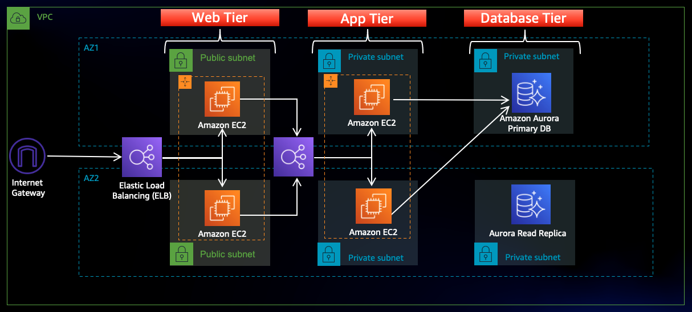
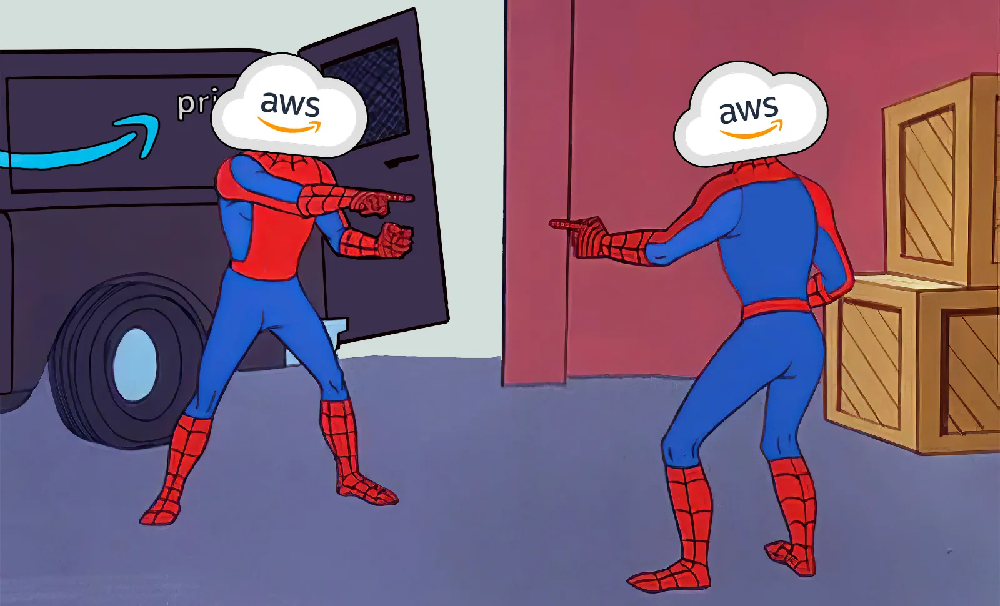

# Building Scalable, Secure, and High-Performance Web Applications with AWS 3-Tier Architecture

## Architecture Overview

*In today’s digital age, building a scalable and secure web application is crucial for business success. The [AWS 3-Tier Web Application Architecture](https://www.ibm.com/topics/three-tier-architecture) stands out as a best practice for deploying cloud-based applications with efficiency and reliability. By leveraging [Amazon Web Services (AWS)](https://catalog.us-east-1.prod.workshops.aws/workshops/85cd2bb2-7f79-4e96-bdee-8078e469752a/en-US/part0/code) to create a three-tier architecture, businesses can achieve enhanced scalability, security, and performance. This architecture divides the application into three layers: the Web Tier, Application Tier, and Database Tier — each designed to handle specific tasks, ensuring seamless operation and optimal user experience. In this blog post, we’ll delve into how the AWS 3-Tier architecture can be leveraged to build resilient and high-performing web applications. You can are a Automation Geek, checkout my [**2 tier architecture**](https://readmedium.com/deploying-2-tier-architecture-in-aws-using-terraform-modules-9143ec6d2623) in AWS using Terraform.*

### **Practical Implementation**

Step 1: Start by creating an S3 bucket which will hold the code for you tier.

STEP 2: Create an instance role for ec2 service, allow access to S3 but only restricted read access.

STEP 3: Create an Separate VPC for this architecture, Separate VPC provides network Isolation.

STEP 4: Create Subnets in different AZ, to create a multi AZ setup.We Will be having two Public and Two private subnets.

STEP 5: Create a 5th and 6th subnet for the private Database, again in multi AZ.

After all the configuration we'll be having 6 subnets, As shown below:

STEP 6: Create an internet Gateway, IGW is used to route traffic from internet to instance and vice versa, if all the newtork restrictions are allowed.

STEP 7: Attach this to the VPC which we just created above.

STEP 8: Create NAT Gateway, NAT in simpler allows instance to access network outside the instance, but doesn't allow external Traffic to come inside the instance.As its A subnet level resource we attach the first NAT to the public subnet 1 in AZ1.

STEP 9: Create a second NAT Gateway and attach it to the second public AZ subnet.

STEP 10: Create the route Tables with the specified subnet and routes.

STEP 11: Edit route table for public destination internet and source IGW.

STEP 12: Subnet Association with the public subnet.

Create route table for the private subnet, but this time in routes add Nat Gateway, Private Subnet.

#### **CREATING SECURITY GROUPS**

In this section we will be creating security groups for all requirments. Security groups plays an integral part of the AWS security best practices, Regulating them can be benificial for you overall security.

1. ALB security group:
    

This allow's internet traffic to reach you ALB.

2) Web Tier Security Group:

This allows traffic from ALB to web Tier.

3) Internal LB SG:

There's an Internal ALB security group, which internally used for networking.

4) SG for private instance:

These allows only Certain IP(MY IP) to access the private instance.

5) DB private SG:

This allows the DB to be accessible from the instance.

#### **Creating Database**

In this Setup We are using RDS as a Database, In This secrion we'll be doing configurations related to the RDS intance.

STEP 1: Creating Subnet Group for RDS

STEP 2: After Subnet Group create Database.We'll be creating a minimal setup of the RDS database as this is for testing purpose, you should not use this for a production setup.

2) Using the Dev Test version for lesser costing.

STEP 3: Create a solid Master password for your database access.

STEP 4: Disable the ec2 connect options as we'll be managing that independently using security groups.

STEP 5: Attach the VPC and security group for the database that we just created in the security group section.

As we have used most of the things for demo, This setup can cost you for database. You can fine tune more settings for reducing you infra cost.

Wait for some time and you can see your database instance:

#### **Instance Management**

STEP 1: Create first instance in the private subnet with no public IP, attach the created security group to it.

STEP 2: Attach an role we just created in the first part.

We'll be connecting this instance using the session manager, for better management of the instance accessibility without using the keys, we can use the session manager.

STEP 3: For Testing purpose, Download the myswl dependencies for testing your RDS Database accessibility.

STEP 4: Copy the writer endpoint from the RDS service page.

STEP 5: login the database using the endpoint. If you are unable to login then you must check your database security group settings.

STEP 6 Adding data in the database.

Refer to this code repository: *git clone* [*https://github.com/aws-samples/aws-three-tier-web-architecture-workshop.git*](https://github.com/aws-samples/aws-three-tier-web-architecture-workshop.git)

#### **Setting up S3 bucket Code Section**

In this section we will be adding the code repository in the s3 bucket storage.

STEP 1: edit the DB config file with the db specific argument, like writer endpoints.

STEP 2: Upload the files of the app tier code in this S3 bucket.

STEP 3: Testing this code Successfully running node application using pm2.

STEP 4: Testing Endpoints.

STEP 5: AS this is an multi AZ setup hence, We have to do the same setup in the second AZ, Hence we'll be creating an Image out of this, And then Creating the Instance in the second AZ.

Security group for private instance and as its app tier

choose the instance profile from the advance section

STEP 6: Creating Target Groups, for load balancing of the app tier.

Choosing the cutom VPC we created in the earlier steps, 4000 is the target port.

/health as the health check endpoint.

STEP 7: Now create an Load Balancer and attach this Target group to this LB.

STEP 8: Select internal as its not an internet facing load balancer.Use the private subnet as its internal.

STEP 9: Attach the internal ALB sg which we created to this ALB.

STEP 10: Creating Launch template for auto scaling for the app tier.

STEP 11: Select Subnet for the app tier private.

STEP 12: Select the existing Load Balancer for the intenal routing , and the taraget group we created above.

STEP 13: Setup Dynamic scaling , keeping desired and all as 2 for maximum fault tolerance and avalability.

Autoscaling group for the app tier will be created successfully.

So the summary for the app tier was that we did all the setup in the ec2 from which we created an image and then put that image as the ami image for the other instance in the launch template , and this launch template will be used by the autoscaling group.. The load balancer wil contact to this instance.

#### **Setting up the web tier**

This Tier will be holding our frontend Tier.

STEP 1: Setup nginx,Edit the nginx conf file, add the proxy pass as the endpoint for the ALB.

Copy the DNS name for the Internal LB.

STEP 2: Edit these files with the endpoint and database connections, and upload this to the S3 bucket under the web-tier folder.

STEP 3: Now setting up instances for the web tier, all the rest configuration is same as for the app tier just change the seurity groups.

STEP 4: Connect it using the session manager.

STEP 5: Setup the instance web tier application same as we did it in the app tier.

STEP 6: Install nginx.

replacing the ngnix.conf file from the edit one which we uploaded in the s3 in the /etc/nginx.

STEP 7: starting nginx server and checking the status.

#### **Now setting up the load balancer**

In this section we'll be creating web Tier autoscaling groups and Load Balancer configurations.

STEP 1: Create ami image for the web instance image as as we did in the app tier.

STEP 2: After successfullt creating the image,Create Target group for this load balancer.

STEP 3: As its an web tier , this time the port is 80.

Now we have two target group one for app tier and other for web tier

STEP 4: As it is internet facing load balancer enable intenet facing and select the public subnet for both the AZ.

STEP 5: Select the public facing Load Balancer security group.

Now create the launch template similarlly to the app tier one jst change the images and the security group related to the web tier.

STEP 6: Creating auto sclaing group for web tier.

As its an web tier and public hence the Subnet will be Public for both AZ

STEP 7: Add the dynamic scaling policy for this web tier auto scaling group.

Launched the web tier load balancer with the 2 capacity.

After the complete setup of both the app and web tier, copy the dns of the web tier load balancer and hit it it will display this page.

The database demo can also be done here, and the amount and description can be directly added to the database from the UI.

### **Conclusion**

Adopting the **AWS 3-Tier Web Application Architecture** is a strategic move for businesses seeking to build secure, scalable, and high-performing applications in the cloud. By effectively separating the web, application, and database layers, this architecture not only enhances performance but also provides robust security and fault tolerance. As organizations continue to scale, the AWS 3-Tier architecture proves to be a reliable and flexible foundation for deploying cloud-based applications. Whether you're launching a new web app or optimizing an existing one, embracing this architecture will set your business up for long-term success in the cloud.

## 🛠️ Author & Community  

This project is crafted by **[Harshhaa](https://github.com/NotHarshhaa)** 💡.  
I’d love to hear your feedback! Feel free to share your thoughts.  

📧 **Connect with me:**

- **GitHub**: [@NotHarshhaa](https://github.com/NotHarshhaa)
- **Blog**: [ProDevOpsGuy](https://blog.prodevopsguy.xyz)  
- **Telegram Community**: [Join Here](https://t.me/prodevopsguy)  

---

## ⭐ Support the Project  

If you found this helpful, consider **starring** ⭐ the repository and sharing it with your network! 🚀  

### 📢 Stay Connected  

