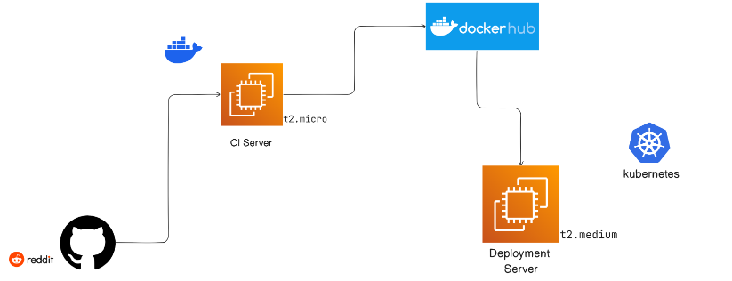

# DevOps Project # 37
This project demonstrates how to deploy a web application on Kubernetes with Ingress and expose it to the world using Minikube as the cluster.
Below is an overview of the architecture of this Reddit Clone App running on Kubernetes with Ingress.



## Prerequisites
Before you begin, you should have the following tools installed on your local machine: 

- Docker
- Minikube cluster ( Running )
- kubectl
- Git

You can install Prerequisites by doing these steps. [click here & complete all steps one by one]().


## Installation
Follow these steps to install and run the Reddit clone app on your local machine:

1) Build the Docker image for the Reddit clone app: `docker build -t reddit-clone-app .`
2) Deploy the app to Kubernetes: `kubectl apply -f deployment.yaml`
3) Deploy the Service for deployment to Kubernetes: `kubectl apply -f service.yaml`
4) Enable Ingress by using Command: `minikube addons enable ingress`
5) Expose the app as a Kubernetes service: `kubectl expose deployment reddit-deployment --type=NodePort --port=5000`
6) Create an Ingress resource: `kubectl apply -f ingress.yaml`


## Test Ingress DNS for the app:
- Test Ingress by typing this command: `curl http://domain.com/test`

## Cluster Monitoring using Prometheus & Grafana

Key Components :

- Prometheus server - Processes and stores metrics data
- Alert Manager - Sends alerts to any systems/channels
- Grafana - Visualize scraped data in UI

Pre Requisites :
- EKS Cluster is setup already
- Install Helm
- EC2 instance to access EKS cluster

Installation Steps 
```sh
helm repo add stable https://charts.helm.sh/stable
helm repo add prometheus-community https://prometheus-community.github.io/helm-charts
helm search repo prometheus-community
kubectl create namespace prometheus
helm install stable prometheus-community/kube-prometheus-stack -n prometheus
kubectl get pods -n prometheus
kubectl get svc -n prometheus
```

Edit Prometheus Service (Edit type : LoadBalancer)
```sh
kubectl edit svc stable-kube-prometheus-sta-prometheus -n prometheus
```

Edit Grafana Service (Edit type : LoadBalancer) 
```sh
kubectl edit svc stable-grafana -n prometheus
```

Verify if service is changed to LoadBalancer and also to get the Load Balancer URL.
```sh
kubectl get svc -n prometheus
```

Access Grafana Dashboard
```sh
UserName: admin 
Password: prom-operator
```


For creating a dashboard to monitor the cluster:

```sh
Click '+' button on left panel and select ‘Import’.
Enter 12740 dashboard id under Grafana.com Dashboard.
Click ‘Load’.
Select ‘Prometheus’ as the endpoint under prometheus data sources drop down.
Click ‘Import’.
```


### Images For reference


## Contributer
<a href = "https://daoudhussain.netlify.app/">
  
</a>