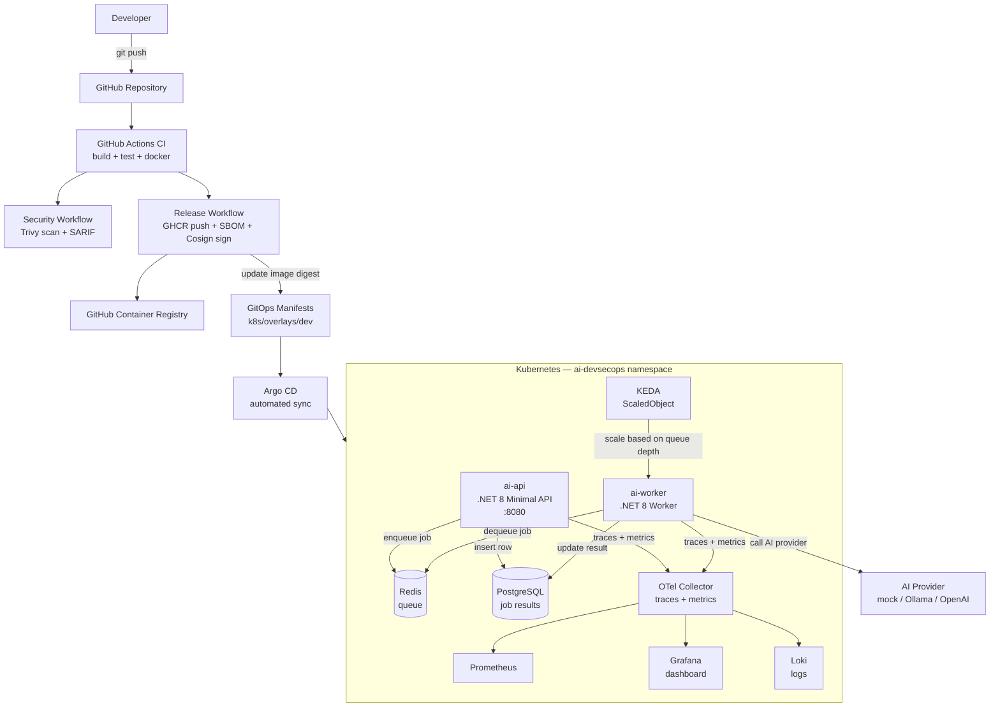

# DevOps-Project-41: AI-Native DevSecOps Platform

> **End-to-end platform for deploying AI-ready applications with GitOps, event-driven autoscaling, full-stack observability, SBOM generation, image signing and DevSecOps security controls on Kubernetes.**

---

## Overview

This project demonstrates how to build and operate a production-grade AI workload delivery platform using modern DevOps and DevSecOps practices. It combines:

- A **.NET 8 Minimal API** that accepts AI inference requests and queues them asynchronously
- A **.NET 8 Worker** that consumes jobs from Redis, calls a configurable AI provider (mock, Ollama, or OpenAI-compatible), and persists results in PostgreSQL
- **GitHub Actions** pipelines for CI, security scanning, SBOM generation, and Cosign image signing
- **Argo CD** for GitOps-based deployment
- **KEDA** for event-driven autoscaling based on Redis queue depth (scales to zero)
- **OpenTelemetry + Prometheus + Grafana + Loki** for traces, metrics and logs
- **Kyverno** admission policies for Kubernetes security governance
- **Trivy** for vulnerability and misconfiguration scanning

The platform runs entirely locally using `kind` with no cloud account required.

---

## Architecture



### Flow summary

| Step | What happens |
|------|-------------|
| 1 | Developer pushes code to GitHub |
| 2 | CI pipeline: restore → build → test → docker build |
| 3 | Security pipeline: Trivy filesystem + image scan → SARIF upload |
| 4 | Release pipeline: GHCR push → SBOM → Cosign keyless sign → verify |
| 5 | Pipeline updates image digest in `k8s/overlays/dev` |
| 6 | Argo CD detects change → syncs to cluster |
| 7 | `POST /ask` enqueues job to Redis, inserts row in PostgreSQL |
| 8 | KEDA detects queue depth → scales `ai-worker` replicas |
| 9 | Worker dequeues job → calls AI provider → updates PostgreSQL |
| 10 | OTel exports traces/metrics to Prometheus/Grafana/Loki |

---

## Tools and Technologies

| Tool | Purpose |
|------|---------|
| .NET 8 Minimal API | AI inference API service |
| .NET 8 Worker Service | Async job processor |
| Redis | Job queue (FIFO via Redis List) |
| PostgreSQL | Job result persistence |
| Docker / Docker Compose | Local development stack |
| kind | Local Kubernetes cluster |
| Kustomize | Kubernetes manifest management (base + overlays) |
| Argo CD | GitOps continuous deployment |
| KEDA | Event-driven autoscaling from Redis queue |
| OpenTelemetry | Distributed traces, metrics and logs |
| Prometheus | Metrics collection and alerting |
| Grafana | Metrics and trace visualisation |
| Loki | Log aggregation |
| GitHub Actions | CI/CD automation |
| GitHub Container Registry | Docker image registry |
| Trivy | Vulnerability, secret and misconfiguration scanning |
| Cosign | Keyless container image signing (Sigstore) |
| Kyverno | Kubernetes admission policies |
| Terraform | Optional cloud infrastructure (EKS/AKS/GKE) |

---

## Prerequisites

| Tool | Version | Install |
|------|---------|---------|
| Docker Desktop | ≥ 24 | [docker.com](https://www.docker.com/products/docker-desktop/) |
| kind | ≥ 0.23 | `brew install kind` |
| kubectl | ≥ 1.29 | `brew install kubectl` |
| Helm | ≥ 3.14 | `brew install helm` |
| .NET SDK | 8.0 | [dotnet.microsoft.com](https://dotnet.microsoft.com/download) |
| k6 (optional) | ≥ 0.51 | `brew install k6` |
| Trivy (optional) | ≥ 0.52 | `brew install trivy` |
| Cosign (optional) | ≥ 2.2 | `brew install cosign` |

---

## Local Development (Docker Compose)

The fastest way to run the full stack locally — no Kubernetes required.

```bash
cd DevOps-Project-41/app

# Start all services (api, worker, redis, postgres, otel-collector, prometheus, grafana)
docker compose up --build

# Test the API
curl http://localhost:8080/health

# Submit an AI job
curl -X POST http://localhost:8080/ask \
  -H "Content-Type: application/json" \
  -d '{"prompt":"Explain GitOps in simple terms","model":"mock-devops-model"}'

# Check job result (replace JOB_ID)
curl http://localhost:8080/jobs/JOB_ID

# Run smoke tests
cd ../tests/smoke && bash smoke-test.sh

# Open Grafana (admin/admin)
open http://localhost:3000

# Open Prometheus
open http://localhost:9091

# Tear down
docker compose down -v
```

---

## Kubernetes Deployment (kind)

### 1. Create the cluster

```bash
kind create cluster --config DevOps-Project-41/infra/kind/kind-cluster.yaml
kubectl cluster-info
kubectl get nodes
```

### 2. Create the postgres secret

```bash
kubectl create namespace ai-devsecops
kubectl -n ai-devsecops create secret generic postgres-secret \
  --from-literal=password=aiops-dev-password
```

### 3. Deploy with Kustomize (without Argo CD)

```bash
kubectl apply -k DevOps-Project-41/k8s/overlays/dev
kubectl -n ai-devsecops get pods -w
```

### 4. Access the API

```bash
kubectl -n ai-devsecops port-forward svc/ai-api 8080:80
curl http://localhost:8080/health
```

---

## GitOps with Argo CD

```bash
# Install Argo CD
kubectl create namespace argocd
kubectl apply -n argocd --server-side --force-conflicts \
  -f https://raw.githubusercontent.com/argoproj/argo-cd/stable/manifests/install.yaml

# Wait for Argo CD to be ready
kubectl -n argocd wait --for=condition=Available deployment/argocd-server --timeout=120s

# Get initial admin password
kubectl -n argocd get secret argocd-initial-admin-secret \
  -o jsonpath="{.data.password}" | base64 -d

# Port-forward the UI
kubectl -n argocd port-forward svc/argocd-server 8080:443

# Apply Argo CD Application (edit GITHUB_OWNER first)
kubectl apply -f DevOps-Project-41/gitops/argocd-app-dev.yaml

# Watch sync status
kubectl -n argocd get applications
```

> Edit `gitops/argocd-app-dev.yaml` and replace `GITHUB_OWNER` with your GitHub username before applying.

---

## Event-Driven Autoscaling with KEDA

```bash
# Install KEDA
helm repo add kedacore https://kedacore.github.io/charts
helm repo update
helm install keda kedacore/keda --namespace keda --create-namespace

# Verify KEDA operator is running
kubectl -n keda get pods

# The ScaledObject is already included in k8s/base/keda-scaledobject-worker.yaml
# After deployment, watch autoscaling:
kubectl -n ai-devsecops get scaledobject
kubectl -n ai-devsecops get hpa
kubectl -n ai-devsecops get deploy ai-worker -w

# Generate load to trigger scaling
cd DevOps-Project-41/tests/load
API_URL=http://localhost:8080 k6 run k6-ai-jobs.js
```

The worker scales from 0 to up to 10 replicas when the `ai-jobs` Redis list grows, and scales back to 0 when the queue is empty.

---

## Observability

### Install Prometheus + Grafana (Helm)

```bash
helm repo add prometheus-community https://prometheus-community.github.io/helm-charts
helm repo update
helm install kube-prometheus-stack prometheus-community/kube-prometheus-stack \
  --namespace monitoring --create-namespace \
  -f DevOps-Project-41/observability/prometheus-values.yaml

kubectl -n monitoring port-forward svc/kube-prometheus-stack-grafana 3000:80
```

### Install Loki (Helm)

```bash
helm repo add grafana https://grafana.github.io/helm-charts
helm install loki grafana/loki-stack \
  --namespace monitoring \
  -f DevOps-Project-41/observability/loki-values.yaml
```

### Import Grafana Dashboard

1. Open Grafana at `http://localhost:3000` (admin/admin)
2. Go to **Dashboards → Import**
3. Upload `DevOps-Project-41/observability/grafana-dashboard.json`

### Dashboard panels

- API Request Rate
- API P95 Latency
- Job Queue Depth
- Worker Replica Count
- Job Success / Failure Rate
- AI Provider Duration (p95)
- Redis Availability
- PostgreSQL Availability

---

## Supply Chain Security

### Trivy scanning

```bash
# Filesystem scan (source + configs)
trivy fs DevOps-Project-41 --severity HIGH,CRITICAL

# Kubernetes manifest scan
trivy config DevOps-Project-41/k8s

# Image scan
trivy image ghcr.io/GITHUB_OWNER/ai-api:1.0.0
```

### SBOM generation

```bash
trivy image --format spdx-json --output sbom-api.spdx.json \
  ghcr.io/GITHUB_OWNER/ai-api:1.0.0
```

See [security/sbom.md](security/sbom.md) for full details.

### Cosign image verification

```bash
cosign verify \
  ghcr.io/GITHUB_OWNER/ai-api:1.0.0 \
  --certificate-identity-regexp "https://github.com/GITHUB_OWNER/DevOps-Projects/.github/workflows/release.yml.*" \
  --certificate-oidc-issuer https://token.actions.githubusercontent.com
```

See [security/cosign.md](security/cosign.md) for full details.

### Kyverno admission policies

```bash
# Install Kyverno
helm repo add kyverno https://kyverno.github.io/kyverno
helm install kyverno kyverno/kyverno --namespace kyverno --create-namespace

# Apply policies
kubectl apply -f DevOps-Project-41/security/policies/

# Test — this should be blocked
kubectl -n ai-devsecops run bad-pod --image=nginx:latest --privileged=true
```

Policies enforce: no privileged containers, runAsNonRoot, resource limits, no latest tag, required labels.

---

## Validation

```bash
# 1. API health
curl http://localhost:8080/health        # expects {"status":"healthy"}

# 2. Full job flow
curl -X POST http://localhost:8080/ask \
  -H "Content-Type: application/json" \
  -d '{"prompt":"What is KEDA?","model":"mock-devops-model"}'
# then GET /jobs/{jobId} until status=completed

# 3. Kubernetes pods
kubectl -n ai-devsecops get pods         # all Running

# 4. Argo CD sync
kubectl -n argocd get applications       # Synced + Healthy

# 5. KEDA scaling
kubectl -n ai-devsecops get scaledobject # READY=True

# 6. Prometheus targets
open http://localhost:9091/targets       # all UP

# 7. Cosign verify
cosign verify ghcr.io/GITHUB_OWNER/ai-api:1.0.0 \
  --certificate-identity-regexp ".*release.yml.*" \
  --certificate-oidc-issuer https://token.actions.githubusercontent.com
```

See [docs/validation-checklist.md](docs/validation-checklist.md) for the full checklist.

---

## Troubleshooting

| Problem | Cause | Fix |
|---------|-------|-----|
| `docker compose up` fails | Port 8080 in use | `lsof -i :8080` and stop conflicting process |
| API returns 503 on `/ready` | Redis or PostgreSQL not ready | Wait for containers to start; check `docker compose logs redis` |
| Worker not processing jobs | Wrong Redis connection string | Verify `REDIS_CONNECTION_STRING` in env |
| KEDA not scaling | Redis address mismatch in ScaledObject | Check `address` field in `keda-scaledobject-worker.yaml` |
| Argo CD not syncing | Wrong `repoURL` or `path` | Edit `gitops/argocd-app-dev.yaml` with correct values |
| Cosign verify fails | Wrong workflow identity | Check `--certificate-identity-regexp` matches your repo path |
| kind cluster not starting | Docker not running | Start Docker Desktop first |

See [docs/troubleshooting.md](docs/troubleshooting.md) for detailed guidance.

---

## Cleanup

```bash
# Remove Argo CD application
kubectl delete -f DevOps-Project-41/gitops/argocd-app-dev.yaml --ignore-not-found=true

# Remove namespaces
kubectl delete namespace ai-devsecops --ignore-not-found=true
kubectl delete namespace argocd --ignore-not-found=true
kubectl delete namespace keda --ignore-not-found=true
kubectl delete namespace monitoring --ignore-not-found=true

# Delete kind cluster
kind delete cluster --name ai-devsecops

# Stop Docker Compose
cd DevOps-Project-41/app && docker compose down -v
```

---

## Future Improvements

- Add AKS / EKS / GKE Terraform modules in `infra/terraform/`
- Integrate External Secrets Operator with a cloud secret manager
- Add Istio or Linkerd service mesh for mTLS and traffic management
- Add canary deployment with Argo Rollouts
- Define SLOs with Sloth or Pyrra
- Add a model gateway for multi-provider routing with rate limiting
- Add Kyverno policy to require signed images at admission time
- Add cost dashboard for AI workload compute
